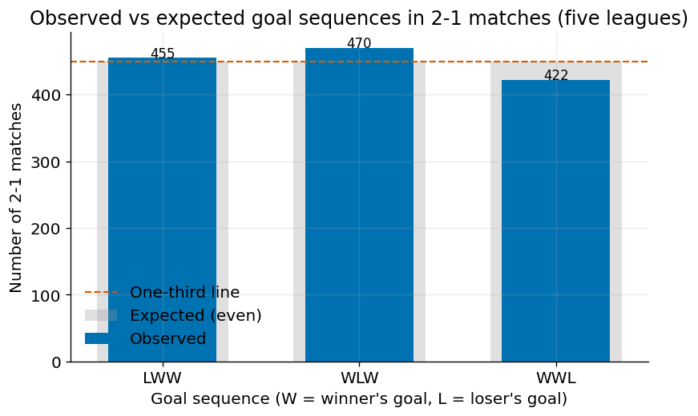

# Analyzing Scoring Patterns in 2–1 Football Matches

A statistical study of whether the goals in a 2–1 football match arrive independently of the
scoreline, or whether the state of the match shapes the scoring process. The analysis covers the
five largest European leagues (England, Spain, Germany, Italy, France) over the 2011/12–2016/17
seasons (10,112 matches).

## Research questions

- **RQ1 — Frequency.** Does the observed frequency of 2–1 results match the frequency predicted by
  a Poisson model of goal scoring?
- **RQ2 — Order.** Within 2–1 matches, are the three possible goal orders (the losing team scoring
  first, second, or last) distributed evenly at one-third each?

Goals are labelled by the eventual **winner (W)** and **loser (L)** of the match rather than by
venue, pooling home and away 2–1 wins to remove home advantage as a confounding factor. The three
orders are therefore **LWW, WLW, and WWL**.

## What the code does

`analysis.py` runs the full pipeline:

1. Loads and cleans the match and event data.
2. Filters to the five leagues and six seasons.
3. Reconstructs each 2–1 match's goal order from goal-by-goal minute data.
4. Runs a chi-square goodness-of-fit test for each research question:
   - **RQ1:** observed 2–1 frequency vs. a Poisson prediction (a simple league-wide model and a
     team-strength model in the spirit of Maher, 1982).
   - **RQ2:** the three goal orders vs. a uniform one-third split, with effect size
     (Cramér's V), standardized residuals, and per-league and per-season breakdowns.
5. Generates four figures (scoreline distribution, goal-order counts, goal-minute histogram, and a
   per-season breakdown).

## Data

This project uses the **"Football Events"** dataset by Alin Secareanu, available on Kaggle:
<https://www.kaggle.com/datasets/secareanualin/football-events>

The dataset is **not redistributed here** (it belongs to its original author). To run the analysis,
download `events.csv` and `ginf.csv` from the link above and place them in the same folder as
`analysis.py`.

## How to run

Requirements: Python 3 with `pandas`, `numpy`, `scipy`, and `matplotlib`.

```bash
pip install pandas numpy scipy matplotlib
python analysis.py
```

The script prints all statistics to the console and saves the four figures to a `figures/` folder.
Set `USE_SIMULATED_DATA = True` at the top of the file to run on generated test data without the
real dataset (useful for checking the code runs before downloading anything).

## Summary of findings

- **RQ1:** 2–1 occurred in 15.1% of matches, deviating significantly from both Poisson models but
  in opposite directions; a team-strength model fits closely.
- **RQ2:** the three goal orders were 455 / 470 / 422 across 1,347 matches and did **not** differ
  significantly from an even split (χ² = 2.69, df = 2, p = 0.26). The order of goals in a 2–1 match
  is statistically indistinguishable from random.



*The three goal orders sit almost exactly on the one-third line, showing no significant departure
from an even split.*

## Author

Aarav Shah 

## References

Key sources are listed in full in the accompanying research paper. The Poisson-modelling approach
follows Maher (1982); the winner/loser pooling is motivated by the home-advantage effect documented
in Pollard (1986).
